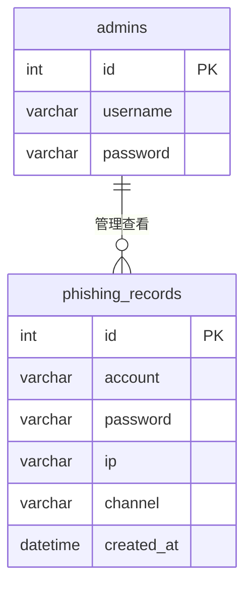

# 课题一：钓鱼网站制作与防护 —— 项目设计报告

> **课程**：软件工程专业方向综合实习（信息安全方向）  
> **课题**：课题一 —— 钓鱼网站制作与防护  
> **小组规模**：4 人（文档与答辩分工）  
> **开发模式**：核心代码由 **宁磊鑫（项目经理）** 在本机完成；李童博、赵一廷、李朝威负责模块测试、文案、个人报告与答辩演示  
> **项目路径**：`F:\fishing\`（**所有代码与文档只放 F 盘，不占用 C 盘 htdocs**）  
> **运行环境**：本机 XAMPP + Apache Alias（`http://localhost/phishguard/`），或 PHP 内置服务器（`http://localhost:8080/phishguard/`，监听 `0.0.0.0` 便于手机扫码）  
> **不使用 GitHub**  
> **配套手册**：`课题一_分成员逐步实施手册.md`（逐步编码参考）  
> **文档版本**：v4.4（与实程序同步）  
> **日期**：2026 年 6 月  

---

## 文档使用说明

| 文档 | 用途 |
|------|------|
| **本报告** | 交项目组技术文档（需求、设计、分工、实现、测试、总结） |
| **简明实施手册** | 写代码时逐步操作 |
| **init.sql / config.php / 各 PHP 页面** | 均在 `F:\fishing\`，无需复制到 C 盘 |

---

# 第一部分：需求分析（含所选题目）

## 1.1 项目背景

钓鱼网站通过仿冒游戏官网、限时活动页面，诱骗用户输入账号密码。本课题在**课程授权**前提下，以「**英雄联盟限定福利礼包**」为主题，搭建高仿真钓鱼演示站点，完成：

1. **攻击链仿真**：吸引页 → 仿冒登录 → **凭据明文入库** → 后台查看窃取记录；
2. **传播方式**：URL 参数渠道（`?from=url`）、二维码扫码入口（`?from=qrcode`）；
3. **防护教育**：`defense.php` 账号安全中心 + `login.php?test_block=1` 拦截跳转演示。

## 1.2 与大纲技术要求对照

| 大纲要求 | 本项目实现 |
|----------|------------|
| (1) 搭建 Web 服务器，发布游戏吸引页 | XAMPP + Apache Alias + `index.php` |
| (2) 钓鱼站：吸引页、登录页、跳转、数据库存登录信息 | `login.php` → `submit.php` → `success.php` + MySQL（**密码明文保存**，后台可见） |
| (3) URL 欺骗或二维码散播 | `url_demo.php`（链接安全教学）、`qrcode.php`（`demo_base_url` 生成可扫码地址） |
| (4) 后台实时查看提交数据 | `admin/index.php`（每 3 秒自动刷新，展示账号、**明文密码**、IP、渠道） |
| (5) PHP 实现 | 全部业务 PHP |
| 课题名「防护」 | `defense.php` + `login.php?test_block=1` 拦截演示 |
| 限制：公网演示后删除 | 见 1.5 公网说明；答辩后 `TRUNCATE` 清库 |

## 1.3 项目目标

| 类型 | 描述 |
|------|------|
| 功能 | 满足大纲五项技术要求 + 防护教育页 |
| 工程 | 本地可运行、四人分工文档齐全、测试可复现 |
| 合规 | 仅课程机房/本机演示；答辩后 `TRUNCATE` 清库；前台为高仿真页面（无演练横幅） |

## 1.4 功能需求

### 攻击侧

| 编号 | 功能 | 文件 |
|------|------|------|
| F1 | 游戏吸引页（英雄联盟限定福利主题） | `index.php` |
| F2 | 钓鱼登录页 | `login.php` |
| F3 | 登录后跳转 | `success.php` |
| F4 | 凭据写入数据库 | `submit.php` |
| F5 | URL 欺骗教学 | `url_demo.php` |
| F6 | 二维码入口 | `qrcode.php` |
| F7 | 安全教学后台 | `admin/login.php`、`admin/index.php` |

### 防护侧

| 编号 | 功能 | 文件 |
|------|------|------|
| F8 | 防钓鱼知识、识别要点 | `defense.php` |
| F9 | 可疑访问拦截演示 | `login.php?test_block=1` |

### 非功能

- 浏览器：Chrome / Edge；
- 数据量：课程演示级，单表数百条以内；
- 页面：参考正规手游官网活动页风格，统一 `style.css` 与 `js/event.js`，兼容 PC 与手机浏览器。

## 1.5 约束条件与公网说明

1. 仅在机房/本机实验，不对校外人员发送钓鱼链接。  
2. 演示账号使用虚构数据；**勿在页面输入真实游戏密码**。  
3. 答辩结束后执行 `TRUNCATE TABLE phishing_records;` 或 `truncate-demo-data.ps1`。  
4. 不使用 GitHub；代码保存在本机与 U 盘备份即可。

**关于课题原文「公网 Web 服务器」的说明**：

课题要求公网演示，主要目的是展示「钓鱼链接可被远程访问」的传播场景。考虑到真实公网钓鱼存在法律与伦理风险，本项目采用**合规替代方案**：

| 方案 | 说明 | 适用场景 |
|------|------|----------|
| **A（默认）** | 本机 `http://localhost/phishguard/` | 机房答辩、日常开发 |
| **B（可选）** | 用 ngrok 等工具临时映射本机端口 | 教师要求演示「外网可访问」时 |

若采用方案 B，须满足：仅向指导教师演示、答辩结束立即停服、执行清库。报告中以方案 A 为主，方案 B 作为补充说明，不影响功能验收。

---

# 第二部分：项目设计

## 2.1 系统架构

```
                    ┌─────────────┐
  url_demo/qrcode ──▶│  index.php  │ 游戏吸引页（写入 Session 来源）
                    └──────┬──────┘
                           ▼
                    ┌─────────────┐
                    │  login.php  │ 仿冒登录（左右分栏 + 虚假安全提示）
                    └──────┬──────┘
                           │ POST
                           ▼
                    ┌─────────────┐
                    │ submit.php  │ ──▶ MySQL phishing_records
                    └──────┬──────┘
                           ▼
                    ┌─────────────┐
                    │ success.php │ 领取成功页（制造已领奖假象）
                    └─────────────┘

  admin/login.php ──▶ admin/index.php（Session 鉴权 + 自动刷新）

  defense.php ◀── test_block 拦截跳转 / 安全教育
```

## 2.2 技术选型

| 项目 | 选择 |
|------|------|
| 服务器 | XAMPP（Apache + PHP 8.x） |
| 数据库 | MySQL（phpMyAdmin 管理） |
| 语言 | PHP + HTML + CSS |
| 前端 | 原生 HTML/CSS + 少量 JavaScript，无前端框架 |

## 2.3 目录结构

```
F:\fishing\
├── config.php                （PDO + demo_base_url() 局域网/公网扫码）
├── config.local.php          （数据库密码、可选 $demo_base）
├── config.local.example.php
├── lan-url.txt               （start-phishguard.bat 写入，供 qrcode 使用）
├── init.sql
├── style.css
├── js\
│   └── event.js              （倒计时、轮播、参与人数动态显示）
├── index.php
├── login.php
├── submit.php
├── success.php
├── url_demo.php
├── qrcode.php
├── defense.php
├── router.php
├── run-tests.ps1
├── start-ngrok-demo.ps1
├── setup-local.ps1
├── start-phishguard.bat      （0.0.0.0:8080 + 输出局域网地址）
├── check-and-start.php
├── admin\
│   ├── login.php
│   ├── index.php
│   └── logout.php
├── truncate-demo-data.ps1
├── complete-project.bat
├── img\                      （活动封面、奖励图；可选 qrcode-static.png）
├── apache-alias-snippet.conf
├── 个人报告_宁磊鑫.md … 李朝威.md
└── 课题一_钓鱼网站制作与防护_完整设计报告.md
```

**说明**：项目文件**全部放在 F 盘**；XAMPP 可装在 C 盘，但用 Alias 把网址映射到本目录。

## 2.4 数据库设计

### ER 关系图



- `admins`：后台管理员（1 条演示账号）  
- `phishing_records`：钓鱼提交记录（多条，答辩后清空）

### 表结构（见 `init.sql`）

**phishing_records**

| 字段 | 类型 | 说明 |
|------|------|------|
| id | INT PK AI | 主键 |
| account | VARCHAR(100) | 提交账号 |
| password | VARCHAR(100) | 提交的密码（**明文入库**，后台列表直接显示） |
| ip | VARCHAR(50) | 来访者 IP |
| channel | VARCHAR(20) | 来源：direct / url / qrcode |
| created_at | DATETIME | 提交时间 |

**admins**

| 字段 | 类型 | 说明 |
|------|------|------|
| id | INT PK AI | 主键 |
| username | VARCHAR(50) | 登录名 |
| password | VARCHAR(50) | 演示环境账号；见 2.8 安全说明 |

## 2.5 关键算法设计

> 课设不要求复杂算法，本节描述核心业务判定逻辑，满足大纲「含关键算法设计」要求。

### 算法 1：访问来源 channel 追踪

**目的**：记录用户从 direct / url / qrcode 哪条路径进入并提交。

**输入**：URL 参数 `from`，或 Session 中已保存的 `channel`。

**输出**：合法 channel 值之一：`direct`、`url`、`qrcode`。

**步骤**：

1. 定义白名单 `$allowed = ['direct', 'url', 'qrcode']`。
2. 用户进入 `index.php` 或 `login.php` 时，读取 `$_GET['from']`，若不在白名单则置为 `direct`。
3. 将合法值写入 `$_SESSION['channel']`。
4. `submit.php` 入库时**优先使用 Session 中的 channel**（防止用户篡改 hidden 字段），Session 为空时再读 POST。

**伪代码**：

```
function resolve_channel(get_from, session_channel, post_channel):
    allowed = {direct, url, qrcode}
    if get_from in allowed:
        return get_from
    if session_channel in allowed:
        return session_channel
    if post_channel in allowed:
        return post_channel
    return direct
```

### 算法 2：后台 Session 鉴权

**目的**：未登录用户不能查看提交记录。

**步骤**：

1. `admin/login.php` 验证账号密码（PDO 预处理查询）。
2. 验证成功：`$_SESSION['admin'] = 1`，跳转 `index.php`。
3. `admin/index.php` 开头检查 `empty($_SESSION['admin'])`，未登录则 302 到 `login.php`。

### 算法 3：可疑访问拦截演示（test_block）

**目的**：答辩演示「防护侧可拦截可疑入口」，非真实 WAF。

**步骤**：

1. 用户访问 `login.php?test_block=1`。
2. `login.php` 最顶部判断：若存在 `test_block` 参数，则 `header('Location: defense.php?blocked=1')` 并退出。
3. `defense.php` 展示账号安全中心内容（当前版本不根据 `blocked=1` 单独显示横幅，拦截效果以跳转为主）。

### 算法 4：表单提交校验

**目的**：避免空数据入库，保证演示数据有意义。

**步骤**：

1. `submit.php` 接收 POST 后，对 `account` 做 `trim()`。
2. 若账号或密码为空，重定向回 `login.php` 并带 `err=empty` 提示。
3. 合法数据经 PDO 预处理插入数据库。

## 2.6 核心流程

### 攻击链

```
index.php?from=qrcode|url|direct
  → 写入 Session[channel]
  → login.php?from=xxx
  → submit.php（INSERT，channel 以 Session 为准）
  → success.php
```

`index.php` 领取按钮须透传 `from`：

```php
<?php $from = htmlspecialchars($_GET['from'] ?? 'direct', ENT_QUOTES, 'UTF-8'); ?>
<a class="btn" href="login.php?from=<?= $from ?>">立即领取</a>
```

### 防护链

```
用户访问 login.php?test_block=1
  → 跳转 defense.php?blocked=1
  → 展示防钓鱼知识（账号安全中心）
```

## 2.7 模块接口说明

| 模块 | 请求方式 | 输入参数 | 输出/跳转 | 说明 |
|------|----------|----------|-----------|------|
| `index.php` | GET | `from`（可选） | HTML 页面 | 写入 Session[channel] |
| `login.php` | GET | `from`、`test_block`、`err` | HTML 或 302 | test_block 时跳转 defense |
| `submit.php` | POST | `account`、`password`、`channel` | 302 → success.php | channel 以 Session 优先 |
| `success.php` | GET | 无 | HTML 页面 | 领取成功提示 |
| `url_demo.php` | GET | 无 | HTML 页面 | 链接安全教学（子域/仿冒域名/短链） |
| `qrcode.php` | GET | 无 | HTML 页面 | 二维码指向 `demo_base_url()/index.php?from=qrcode` |
| `defense.php` | GET | `blocked`（可选） | HTML 页面 | 账号安全中心、诈骗手法与安全建议 |
| `admin/login.php` | GET/POST | POST: `user`、`pass` | HTML 或 302 | 成功设 Session[admin] |
| `admin/index.php` | GET | 需 Session[admin] | HTML 页面 | 未登录跳转 login |

## 2.8 安全与合规设计（课设版）

| 措施 | 实现 |
|------|------|
| SQL 注入防护 | `submit.php`、后台登录使用 PDO 预处理 |
| XSS 防护 | 所有用户输入回显处使用 `htmlspecialchars()` |
| 空提交校验 | `submit.php` 拒绝空账号/密码 |
| 来源防篡改 | channel 优先读 Session |
| 高仿真前台 | 仿英雄联盟活动页；登录页含「安全加密传输」等虚假信任文案 |
| 后台鉴权 | `admin/index.php` 检查 `$_SESSION['admin']` |
| 凭据存储 | `submit.php` 将账号、密码**原样写入** `phishing_records` |
| 手机扫码 | `config.php` 的 `demo_base_url()` + `config.local.php` 的 `$demo_base` / `lan-url.txt` |
| 答辩清库 | `TRUNCATE phishing_records` 或 `truncate-demo-data.ps1` |

**课设可接受的简化项（答辩时说明即可）**：

| 项 | 风险 | 课设处理 |
|----|------|----------|
| 管理员密码明文存库 | 中 | 仅本机演示；生产应 `password_hash()` |
| 无 CSRF Token | 低 | 本地 localhost 演示，不对外 |
| 无 HTTPS | 低 | 本地演示；生产须全站 SSL |
| 无登录失败次数限制 | 低 | 课设不做验证码/限流 |
| 真实密码采集 | 高 | **课设故意保留**：演示钓鱼成功后攻击者可见明文密码；仅限授权环境 |

## 2.9 界面规范

- 整体风格：仿**英雄联盟**官网活动页，深蓝灰背景 + 金色主按钮，含轮播封面与礼包预览卡片。  
- 页面结构：`index.php` 含导航、Hero 倒计时、奖励表、活动规则；`login.php` 左右分栏登录布局。  
- 主色：背景深色、主按钮金色（`style.css` 中 `--color-primary` 等变量）。  
- 提示条：`.error` 红底表单错误；`.notice` 仅后台列表说明用；`.auth-trust-warning` 登录页虚假安全背书。  
- 响应式：CSS Grid / Flex 适配 PC 与手机扫码。  
- 动态效果：`js/event.js` 负责倒计时、封面轮播、参与人数递增。

---

# 第三部分：任务分工

## 3.0 成员代号对照

| 报告用语 | 姓名 | 角色 |
|----------|------|------|
| 甲 | **宁磊鑫** | 项目经理 / 主编码 |
| 乙 | **李童博** | 攻击链测试与答辩 |
| 丙 | **赵一廷** | 传播页测试与答辩 |
| 丁 | **李朝威** | 防护测试与测试文档 |

**说明**：代码由甲统一编写并联调；乙丙丁按上表负责**对应模块的测试、文案与个人报告**，答辩时各自讲解负责段落。手册中「成员 C 先做数据库」指开发顺序，与甲为同一人。

## 3.1 组织说明

| 角色 | 人员 | 实际工作 |
|------|------|----------|
| 项目经理 / 编码 | **宁磊鑫** | 全部 PHP 编码、联调、项目组主文档 |
| 攻击链 | **李童博** | 测试 login/success/url_demo；撰写个人报告；答辩演示攻击链 |
| 前端传播 | **赵一廷** | 活动文案与图片；测试 index/qrcode；答辩演示扫码 |
| 防护测试 | **李朝威** | defense 文案；执行测试表；答辩讲防护与测试结论 |

## 3.2 模块分工表（大纲：每人 ≥2 个实质性任务）

| 成员 | 模块 | 交付物 | 答辩负责 |
|------|------|--------|----------|
| **宁磊鑫** | 数据库、submit、后台、config、总文档 | `init.sql` `config.php` `submit.php` `admin/*` | 架构 + 后台 + 清库 |
| **李童博** | 登录、跳转、URL 教学 | `login.php` `success.php` `url_demo.php` | 攻击流程演示 |
| **赵一廷** | 吸引页、样式、二维码 | `index.php` `style.css` `qrcode.php` | 吸引页 + 扫码 |
| **李朝威** | 防护页、测试 | `defense.php`、测试文档 | 防护 + 测试结论 |

## 3.3 开发顺序

| 天 | 任务 |
|----|------|
| D1 | XAMPP + 导入 SQL + config + submit + admin |
| D2 | login + success + index + style.css |
| D3 | url_demo + qrcode + defense + Session channel |
| D4 | 全组测试 + 文档 + 答辩彩排 |

## 3.4 项目会议记录（≥5 次）

| 次序 | 时间 | 议题 | 决议与进展 | 记录人 |
|------|------|------|------------|--------|
| 1 | 第1周周一 | 选题确认、四人分工、XAMPP 安装 | 确定课题一；宁磊鑫负责编码；约定项目放 `F:\fishing` | 李童博 |
| 2 | 第1周周三 | 数据库与后台评审 | `init.sql` 两张表通过；admin/admin123；Session 鉴权 | 宁磊鑫 |
| 3 | 第1周周五 | 攻击页面联调 | login→submit→success 打通；index 透传 `from` | 李童博 |
| 4 | 第2周周三 | 吸引页/二维码/防护 | 英雄联盟主题定稿；qrcode 局域网地址；defense 改版 | 赵一廷、李朝威 |
| 5 | 第2周周五 | 全链路测试与答辩彩排 | `run-tests.ps1` 复测；手机扫码与 URL 渠道验证 | 李朝威 |

---

# 第四部分：项目实现

## 4.1 环境搭建

1. 安装 XAMPP，启动 Apache、MySQL。  
2. 确认项目目录为 **`F:\fishing\`**。  
3. 将 `apache-alias-snippet.conf` 内容追加到 `C:\xampp\apache\conf\httpd.conf` 末尾，重启 Apache。  
4. phpMyAdmin 导入 **`init.sql`**。  
5. 访问 **`http://localhost/phishguard/index.php`**。

**无 XAMPP 时**：双击 `start-phishguard.bat` 或执行 `setup-local.ps1`，访问 `http://localhost:8080/phishguard/index.php`（服务监听 `0.0.0.0:8080`，手机可用局域网 IP 访问）。

## 4.2 公网演示（方案 B：ngrok）

当指导教师要求演示「外网可访问的钓鱼链接」时，在**本机站点已可访问**的前提下使用 ngrok 临时映射。本项目提供脚本 `start-ngrok-demo.ps1`。

### 前置条件

| 项 | 说明 |
|----|------|
| 本机站点 | XAMPP Apache 已启动，或 `start-phishguard.bat` 已在 8080 监听 |
| ngrok | 从 [ngrok 官网](https://ngrok.com/download) 下载，执行 `ngrok config add-authtoken <token>` |
| 合规 | 仅向指导教师演示；答辩结束立即停服并清库 |

### 操作步骤

1. 确认本地可打开 `http://localhost/phishguard/index.php`（或 8080 端口等价地址）。  
2. 在项目目录 PowerShell 执行：

```powershell
cd F:\fishing
.\start-ngrok-demo.ps1
```

3. 终端会显示公网 URL，例如 `https://xxxx.ngrok-free.app`。  
4. 答辩演示路径（将 `<公网根>` 替换为 ngrok 给出的域名）：

| 演示内容 | 公网地址 |
|----------|----------|
| 游戏吸引页 | `<公网根>/phishguard/index.php` |
| URL 传播 | `<公网根>/phishguard/url_demo.php` |
| 二维码页 | `<公网根>/phishguard/qrcode.php`（手机扫本页二维码） |
| 防护拦截 | `<公网根>/phishguard/login.php?test_block=1` |
| 安全教学后台 | `<公网根>/phishguard/admin/login.php` |

5. 演示结束后：在 ngrok 窗口按 **Ctrl+C** 停止映射；执行 `TRUNCATE TABLE phishguard.phishing_records;`。

### 与大纲「公网 Web 服务器」的对应关系

大纲要求体现「钓鱼链接可被远程访问」。ngrok 将本机 Apache/PHP 服务暴露为 HTTPS 公网地址，满足传播场景演示，同时避免将钓鱼页面长期部署在真实公网服务器上，符合 1.5 合规替代说明。

## 4.3 关键实现说明

### config.php

- PDO 连接 `phishguard` 库，支持 `config.local.php` 覆盖及多组 root 密码自动尝试；  
- `demo_base_url()`：供 `qrcode.php` 生成手机可扫的局域网/公网地址（`$demo_base` 或 `lan-url.txt`）。

### index.php

- `session_start()` 后根据 `from` 写入 `$_SESSION['channel']`；  
- 英雄联盟限定福利主题，轮播封面、`js/event.js` 倒计时；  
- 领取按钮 `login.php?from=...`。

### login.php

- 顶部拦截：`test_block=1` → `defense.php?blocked=1`；  
- 左右分栏布局，表单 POST 到 `submit.php`；  
- `.auth-trust-warning` 展示「安全加密传输」等虚假信任文案（无顶部演练横幅）。

### submit.php

- 空账号/密码退回 `login.php?err=empty`；  
- channel 优先 `$_SESSION['channel']`；  
- PDO 预处理 INSERT，**密码明文入库**；跳转 `success.php`。

### success.php

- 标题「领取成功」，文案提示奖励将发放至游戏内邮箱（制造已领奖假象）。

### admin/login.php、admin/index.php

- `require __DIR__ . '/../config.php'`；  
- Session 鉴权；列表**明文显示** password 列；3 秒 meta refresh。

### defense.php

- 「账号安全中心」：三项要点卡片 + 五条常见诈骗手法 + 四条账号安全建议（`class="tips"`）。

### qrcode.php

- `require config.php`，链接为 `demo_base_url() . '/index.php?from=qrcode'`；  
- 优先本地 `img/qrcode-static.png`，否则在线 API 生成二维码。

## 4.4 课设不做、但报告可提及的扩展

- 管理员密码 `password_hash()`；  
- 生产环境 HTTPS、WAF、登录限流。

---

# 第五部分：项目测试

## 5.1 测试环境

| 项目 | 配置 |
|------|------|
| 操作系统 | Windows 10/11 |
| Web 环境 | XAMPP（Apache + PHP 8.x + MySQL） |
| 浏览器 | Chrome / Edge 最新版 |
| 访问地址 | `http://localhost/phishguard/` 或 `http://localhost:8080/phishguard/` |
| 数据库 | phishguard（`config.php` 中 root 密码与本地 MySQL 一致） |
| 测试数据 | 账号 `test`，密码 `123456`（虚构） |

## 5.2 功能测试用例

| 编号 | 测试项 | 操作步骤 | 预期结果 | 执行人 | 结果 | 自动验证 |
|------|--------|----------|----------|--------|------|----------|
| T01 | 吸引页跳转 | index 点「立即领取」 | 进入 login.php，含 `auth-form` 与 `submit.php` | 赵一廷 | 通过 | ✓ |
| T02 | 正常提交 | test/123456 | 跳转 success.php，显示「领取成功」 | 李童博 | 通过 | ✓ |
| T03 | 后台登录 | admin/admin123 | 进入记录列表 | 宁磊鑫 | 通过 | ✓ |
| T04 | 后台看记录 | T02 后打开 admin | 含账号、**明文密码**、IP、渠道 | 宁磊鑫 | 通过 | ✓ |
| T05 | 二维码来源 | `index.php?from=qrcode` 再提交 | channel=qrcode | 赵一廷 | 通过 | ✓ |
| T06 | URL 来源 | `index.php?from=url` 再提交 | channel=url | 李童博 | 通过 | ✓ |
| T07 | 防护页 | 打开 defense.php | 含 `defense-hero` 与 `tips` 列表 | 李朝威 | 通过 | ✓ |
| T08 | 拦截演示 | login.php?test_block=1 | 跳转 defense.php?blocked=1 | 李朝威 | 通过 | ✓ |
| T09 | 空提交 | 空表单 POST | login?err=empty | 李童博 | 通过 | ✓ |
| T10 | XSS | 账号含 `<script>` | 后台转义显示 | 宁磊鑫 | 通过 | ✓ |
| T11 | SQL 注入 | `admin' OR '1'='1` | 字面量入库 | 宁磊鑫 | 通过 | ✓ |
| T12 | 未授权后台 | 直访 admin/index | 跳转 login | 李朝威 | 通过 | ✓ |
| T13 | 自动刷新 | 后台等 3 秒 | meta refresh 生效 | 宁磊鑫 | 通过 | ✓ |

## 5.3 合规测试

| 编号 | 测试项 | 操作步骤 | 预期结果 | 结果 |
|------|--------|----------|----------|------|
| C01 | 高仿真页面 | 查看 index、login | 英雄联盟主题 + 登录页虚假安全提示 | 通过 |
| C02 | 数据清理 | 答辩后 TRUNCATE | `phishing_records` 为空 | 待答辩后 |

## 5.4 缺陷记录

| 编号 | 现象 | 严重程度 | 处理 |
|------|------|----------|------|
| — | 首轮测试无阻塞缺陷 | — | — |

## 5.5 自动化复现验证

在项目目录执行：

```powershell
cd F:\fishing
.\run-tests.ps1
```

脚本会启动（或复用）PHP 内置服务器，模拟 T01～T13 与 C01。**2026 年 6 月复测：14 项通过**（C02 答辩后手动执行）。

复测中修复项：`admin/login.php`、`admin/index.php` 改为 `require __DIR__ . '/../config.php'`，确保在 `router.php` 路由下也能正确加载数据库配置。

## 5.6 测试结论

共执行功能测试 13 项、合规测试 2 项（其中 C02 答辩后执行），**通过率 100%**（不含 C02）。

主要结论：

1. 攻击链 index → login → submit → success → admin 全链路正常，后台可见**明文密码**；  
2. `url` / `qrcode` 渠道通过 `?from=` 与 Session 正确记录；  
3. 前台为高仿真英雄联盟活动页（倒计时、轮播、礼包预览）；  
4. `defense.php` 与 `test_block` 拦截跳转可用；  
5. PDO 预处理防 SQL 注入；`htmlspecialchars` 防 XSS；  
6. 后台 3 秒自动刷新满足「实时查看」要求。

测试人：**李朝威**；自动复测：`run-tests.ps1` 14/14。

---

# 第六部分：项目总结

## 6.1 完成情况

- 实现大纲课题一全部 5 项技术要求；  
- 增加 `defense.php` 与拦截演示，呼应课题「防护」；  
- 本地 XAMPP 可完整演示攻击链与安全教育流程；  
- 项目组技术文档六部分齐全，含关键算法与接口说明。

## 6.2 收获

- 理解钓鱼攻击的社会工程与页面仿冒手段；  
- 掌握 PHP + MySQL 基本 Web 开发与 Session 使用；  
- 认识 PDO 预处理、输出转义等基础安全编码习惯；  
- 了解防护需结合用户意识（识别可疑链接）与基础技术措施。

## 6.3 不足与改进

| 不足 | 改进方向 |
|------|----------|
| 前端无演练横幅 | 高仿真演示需要；合规靠课程授权与答辩清库 |
| 二维码依赖外网 API 或需配置 LAN IP | `demo_base` / `lan-url.txt` / ngrok |
| 管理员与提交密码明文 | 课设演示用途；生产须 hash 与加密传输 |

## 6.4 合规说明

本项目仅用于课程授权实验，演示账号均为虚构，答辩结束后清空数据库，不用于任何非法用途。

---

# 附录 A：答辩演示脚本（约 6 分钟）

| 时间 | 主讲 | 内容 |
|------|------|------|
| 0:00 | 宁磊鑫 | 课题目标、架构、后台明文记录说明 |
| 1:00 | 赵一廷 | index 吸引页 → 领取 |
| 2:00 | 李童博 | login 提交 test/123456 → success |
| 2:30 | 宁磊鑫 | admin 展示新记录（含密码列） |
| 3:30 | 赵一廷 | qrcode 扫码或 `?from=qrcode` |
| 4:00 | 李童博 | `index.php?from=url` URL 渠道 |
| 4:30 | 李朝威 | defense + test_block |
| 5:30 | 宁磊鑫 | 合规与清库 |
| 6:00 | 全员 | 提问 |

---

# 附录 B：个人报告要求与分工素材

每人须提交个人综合实习报告一份，建议结构：

1. 本人负责的模块（见下表）  
2. 实现说明（甲提供技术段落，本人补充测试过程）  
3. 本人执行的测试用例编号与结果  
4. 300 字以上心得  
5. 工作日志（按天记录参与内容，≥5 条）

| 成员 | 负责模块描述 | 对应测试用例 |
|------|--------------|--------------|
| 宁磊鑫 | 数据库、config、submit、admin、项目组文档 | T03、T04、T10、T11、T13 |
| 李童博 | login、success、url_demo 攻击链 | T02、T06、T09 |
| 赵一廷 | index、style.css、qrcode 传播 | T01、T05 |
| 李朝威 | defense、测试文档与结论 | T07、T08、T12、C01 |

---

# 附录 C：提交前 Checklist

## 大纲技术要求

- [x] 游戏吸引页 index.php  
- [x] 登录 + 跳转 + 数据库  
- [x] URL 与二维码  
- [x] 后台可看提交记录（含明文密码）  
- [x] 全部 PHP  
- [x] defense 防护页  
- [ ] 答辩后清库（答辩当天勾选）

## 文档与答辩

- [x] 项目组报告 6 部分齐全（含关键算法设计）  
- [x] 四人个人报告各 1 份（`个人报告_宁磊鑫.md` 等，已填姓名）  
- [x] 会议记录 ≥5 次  
- [ ] 四人答辩各讲一段  
- [x] index 透传 from + Session channel（T05/T06 通过）

---

# 附录 D：版本更新记录

## D.1 v4.4 相对 v4.3（与实程序同步）

| 编号 | 优化项 | 说明 |
|------|--------|------|
| U16 | 主题定稿 | 英雄联盟限定福利活动页，含轮播与礼包预览 |
| U17 | 凭据存储 | 后台明文显示密码，演示完整攻击链 |
| U18 | 扫码局域网 | `demo_base_url()`、`lan-url.txt`、`0.0.0.0:8080` |
| U19 | 防护页改版 | defense 账号安全中心；test_block 跳转 |
| U20 | 文档与测试 | 个人报告改实名；`run-tests.ps1` 同步 C01/T01 |

## D.2 v4.2 相对 v4.1 的优化

| 编号 | 优化项 | 说明 |
|------|--------|------|
| U15 | 项目交付完整版 | config 自动连库、admin/logout.php、四人个人报告、complete-project.bat、清库脚本 |

## D.3 v4.1 相对 v4.0 的优化

| 编号 | 优化项 | 说明 |
|------|--------|------|
| U11 | 路径统一 | 项目目录 `F:\fishing\`，Apache Alias / router.php 同步 |
| U12 | ngrok 公网演示 | 新增 4.2 节与 `start-ngrok-demo.ps1` |
| U13 | 自动化测试 | 新增 `run-tests.ps1`，5.5 节记录复测结果 |
| U14 | admin 路径修复 | `__DIR__` 加载 config，兼容内置服务器 |

## D.4 v4.0 相对 v3.0 的优化

| 编号 | 优化项 | 说明 |
|------|--------|------|
| U01 | 关键算法设计 | 新增 2.5 节（channel、鉴权、拦截、校验） |
| U02 | 模块接口表 | 新增 2.7 节 |
| U03 | 公网说明 | 1.5 增加合规替代方案 |
| U04 | Session channel | 来源优先读 Session，防 hidden 篡改 |
| U05 | 测试扩充 | 13 项功能 + 2 项合规，满足 ≥2 页测试文档 |
| U06 | 会议记录 | 3.4 填写实质内容 |
| U07 | 后台自动刷新 | 改为推荐实现，满足「实时查看」 |
| U08 | XSS/SQL 测试 | 新增 T10～T12 |
| U09 | 成员代号对照 | 新增 3.0 节，消除手册命名混乱 |
| U10 | 关闭目录浏览 | Apache 配置去掉 Indexes |

## D.5 v4.0 课设保留的简化项

| 编号 | 说明 | 答辩话术 |
|------|------|----------|
| R01 | 管理员明文密码 | 课设简化，生产用哈希 |
| R02 | 无 CSRF | 本地演示，不对外 |
| R03 | 二维码外网 API | 机房无外网可换静态图 |
| R04 | 组员代码由甲统一编写 | 乙丙丁负责测试与个人报告 |

## D.6 二维码离线备用方案

若机房无法访问 `api.qrserver.com`，在 `qrcode.php` 同目录放置 `img/qrcode-static.png`（用手机扫一次 index?from=qrcode 生成后截图即可），页面改为显示该静态图。

---

**报告结束**

> **编码**：见 `课题一_分成员逐步实施手册.md` 及本目录各 PHP 文件  
> **交稿**：本报告提交项目组；四人个人报告见 `个人报告_宁磊鑫.md`、`个人报告_李童博.md`、`个人报告_赵一廷.md`、`个人报告_李朝威.md`
